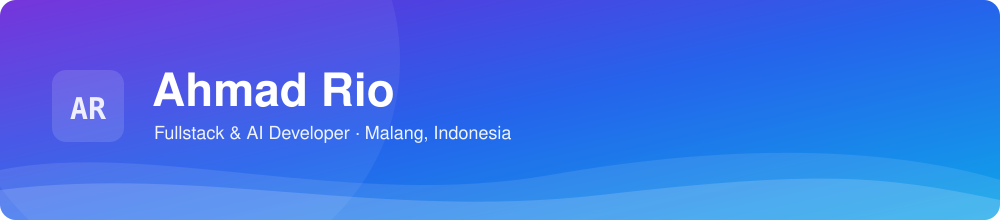

<div align="center">



<a href="https://github.com/ahmadrio">
  
</a>

<br />

**Fullstack & AI developer di Malang.** Membangun aplikasi web dan sistem internal
untuk klien pemerintah dan enterprise — dari API sampai antarmuka.

<a href="https://www.linkedin.com/in/ahmad-rio-257152192/">
  
</a>
<a href="mailto:ahmadrio28asia@gmail.com">
  
</a>
<a href="https://wa.link/2vk7se">
  
</a>
<a href="https://ahmadrio-dot.vercel.app">
  
</a>

</div>

---

## 👨‍💻 Tentang saya

- 📍 Berbasis di **Malang, Indonesia** — tersedia untuk kerja **freelance**
- 🏛️ **10+ tahun** menggarap aplikasi web & sistem internal untuk instansi pemerintah dan perusahaan besar — portal informasi publik, aplikasi reservasi, tanda tangan elektronik, hingga super app
- ⚙️ Fokus pada **backend yang stabil dan mudah dirawat**, dengan antarmuka yang tetap nyaman dipakai
- 🤖 Belakangan banyak membangun **fitur berbasis AI & LLM** ke dalam produk nyata
- 🌐 Portofolio lengkap: **`https://ahmadrio-dot.vercel.app`**

```text
15+ proyek selesai   ·   10+ klien pemerintah & enterprise   ·   10+ tahun pengalaman
```

---

## 🛠️ Tech Stack

**Bahasa & Markup**


**Framework & Library**


**Database**


**AI**


**Tools & Infra**


---

## 📌 Proyek pilihan

| Proyek | Peran | Ringkasan |
| --- | --- | --- |
| **DPR RI — PPID** | Backend | Portal permohonan informasi publik: warga mengajukan lewat formulir, petugas menindaklanjuti sampai jawaban terbit |
| **DPR RI — ESign (Pena)** | Frontend · Backend · AI | Tanda tangan elektronik dokumen dinas dengan antrean persetujuan berlapis dan riwayat tersimpan |
| **Kalla Super Apps — Web** | Backend | Sisi web super app Grup Kalla untuk layanan akademik: pendaftaran siswa sampai administrasinya |
| **Mind ID — Pensiun Sukarela** | Frontend · Backend | Pendaftaran program pensiun sukarela karyawan, lengkap dengan simulasi manfaat dan pemantauan saldo |
| **Kost Malang Suhat** | Frontend · Backend · AI | Proyek pribadi: cari kost di sekitar Suhat, pencarian bisa pakai kalimat sehari-hari lewat bantuan AI |

<sub>Lihat semua proyek → <b><code>https://ahmadrio-dot.vercel.app</code></b></sub>

---

## 📊 Aktivitas


Repositori publik saya ada di tab [**Repositories**](https://github.com/ahmadrio?tab=repositories).

---

## 📫 Hubungi saya

Saya siap kapan pun Anda siap.

| | |
| --- | --- |
| ✉️ Email | [ahmadrio28asia@gmail.com](mailto:ahmadrio28asia@gmail.com) |
| 💬 WhatsApp | [0821-3940-5016](https://wa.link/2vk7se) |
| 💼 LinkedIn | [ahmad-rio-257152192](https://www.linkedin.com/in/ahmad-rio-257152192/) |
| 📍 Lokasi | Malang, Indonesia |

<div align="center">


</div>
